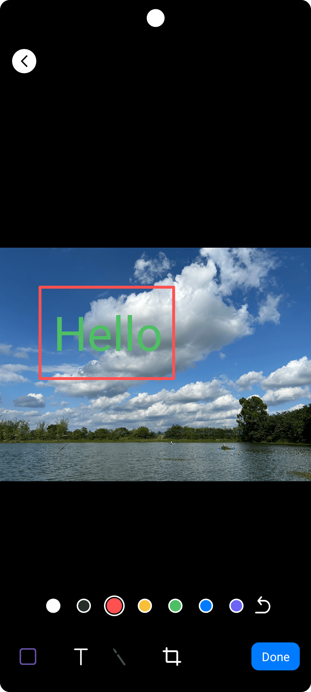
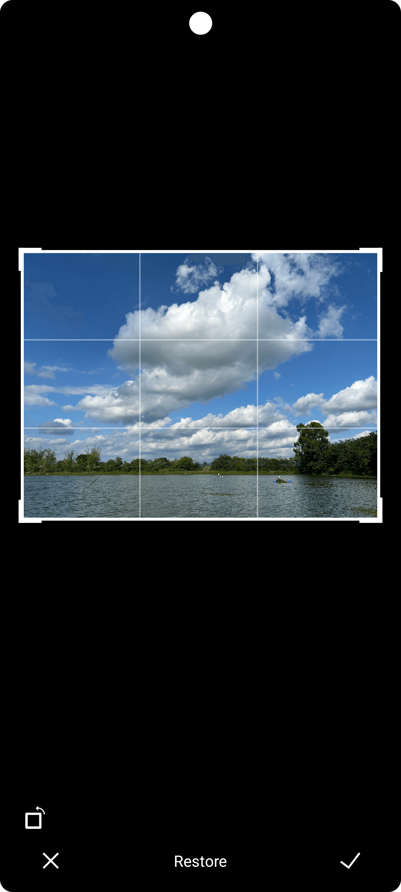

# Imaging Library

An image editor library for Android. Similar to the image editor in the WeChat app.

### Main features:

- **Drawing a box**
- **Drawing a circle**
- **Drawing text**
- **Drawing an arrow**
- **Doodle**
- **Image cropping**

<div style="display: flex; justify-center; align-items: center;">       </div>

### How to use

1. Need to add the jitpack.io repository in settings.gradle:

   ```java
   dependencyResolutionManagement {
       repositoriesMode.set(RepositoriesMode.FAIL_ON_PROJECT_REPOS)
       repositories {
           google()
           mavenCentral()
           maven { url "https://jitpack.io" }
       }
   }
   ```

2. Add to dependencies in build.gradle of app level:

   ```java
   dependencies {
       implementation 'com.github.xuzepei:imaging:1.0.1'
   }
   ```

3. Sample code:

   ```Ja
   //Show multiple components by setting the style with value, such as BOX_ENABLE, CIRCLE_ENABLE, TXT_ENABLE, PAINT_ENABLE, ARROW_ENABLE, MOSAIC_ENABLE and CLIP_ENABLE
   
   TRSPictureEditor.setStyle(TRSPictureEditor.CLIP_ENABLE | TRSPictureEditor.BOX_ENABLE | TRSPictureEditor.TXT_ENABLE | TRSPictureEditor.PAINT_ENABLE);
   TRSPictureEditor.edit(this, originalBitmap, new TRSPictureEditor.EditAdapter() {
       @Override
       public void onComplete(Bitmap bitmap) {
           if (bitmap != null) {
               //The bitmap edited
           }
       }
   });

4. Localization: this library only supports English by now. But you can localize it by setting different languages for these string ids.
     
     ```java
     <resources>
         <string name="image_doodle">"Doodle"</string>
         <string name="image_text">"Text"</string>
         <string name="image_mosaic">"Mosaic"</string>
         <string name="image_clip">"Crop"</string>
         <string name="image_reset">"Restore"</string>
         <string name="image_done">"Done"</string>
         <string name="image_cancel">"Cancel"</string>
         <string name="image_rotate">"Rotate"</string>
         <string name="image_mosaic_tip">"Blur"</string>
         <string name="image_undo">"Undo"</string>
         <string name="image_all_photo">"All Photos"</string>
         <string name="image_original">"Original"</string>
         <string name="image_preview">"Preview"</string>
     </resources>
     ```
### Thanks

I am also standing on the shoulders of giants. Thanks to these projects.

> [WeiXinPictureTool-master](https://github.com/zhuguohui/WeiXinPictureTool-master)

> [Android仿微信图片编辑处理：文字，马赛克，裁剪，涂鸦，旋转图片等](https://blog.csdn.net/zhangphil/article/details/87860431)